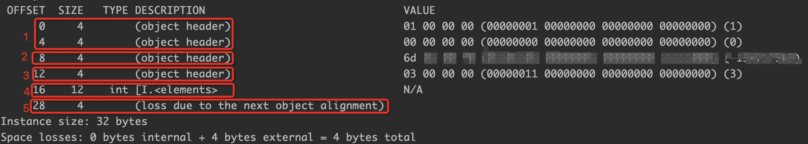
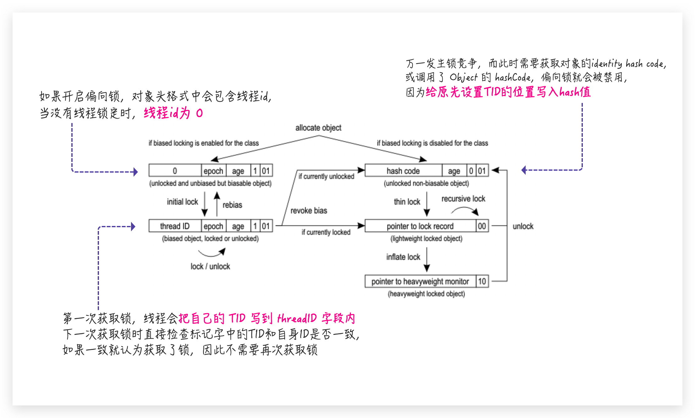

# 对象头

| 内容                                 | 说明                       | 备注                                                         |
| ------------------------------------ | -------------------------- | ------------------------------------------------------------ |
| Mark Word                            | 存储对象的Mark Word信息    |                                                              |
| Class Metadata Address（Klass Word） | 存储指向对象存储类型的指针 |                                                              |
| Array Length                         | 数组的长度                 | 只有数组对象有该属性                                         |
| Instance Data                        | 实例数据                   |                                                              |
| Padding                              | 对齐补充                   | HostSpot VM 的自动内存管理系统要求对象的起始地址必须是8字节的整数倍 |

打印对象头工具

```xml
        <dependency>
            <groupId>org.openjdk.jol</groupId>
            <artifactId>jol-core</artifactId>
            <version>0.9</version>
        </dependency>
```

```java
    private static int[] arr = {1, 2, 3};

    public static void main(String[] args) {
        System.out.println(ClassLayout.parseInstance(arr).toPrintable());
    }
```



在32位下，Mark Word的存储结构如下：

  <table>
   <tr>
    <td>锁状态</td>
    <td>23 bits</td>
    <td>2 bits</td>
    <td>4 bits</td>
    <td>1 bit</td>
    <td>2 bits</td>
   </tr>
   <tr>
    <td>无锁状态</td>
    <td colspan="2">identity hash code（首次调用）</span></td>
    <td>分代年龄</td>
    <td>0</td>
    <td>1</td>
   </tr>
   <tr>
    <td>偏向锁</td>
    <td>Thread ID</td>
    <td>epoch</td>
    <td>分代年龄</td>
    <td>1</td>
    <td>1</td>
   </tr>
   <tr>
    <td>轻量级锁</td>
    <td colspan="4">指向线程栈中Lock Record的指针</td>
    <td>0</td>
   </tr>
   <tr>
    <td>重量级锁</td>
    <td colspan="4">指向监视器（monitor）的指针</td>
    <td>10</td>
   </tr>
   <tr>
    <td>GC标记</td>
    <td colspan="4">0</td>
    <td>11</td>
   </tr>
  </table>

在64位下，Mark Word的存储结构如下：

  <table>
   <tr>
    <td>锁状态</td>
    <td >25 bits</td>
    <td >31 bits</td>
    <td >1 bit</td>
    <td >4 bits</td>
    <td >1 bit</td>
    <td >2 bits</td>
   </tr>
   <tr>
    <td>无锁状态</td>
    <td>unused</td>
    <td>identity hash code（首次调用）</span></td>
    <td>unused</td>
    <td>分代年龄</td>
    <td>0</td>
    <td>1</td>
   </tr>
   <tr>
    <td>锁状态</td>
    <td>54 bits</td>
    <td>2 bits</td>
    <td>1 bit</td>
    <td>4 bits</td>
    <td>1 bit</td>
    <td>2 bits</td>
   </tr>
   <tr>
    <td>偏向锁</td>
    <td>Thread ID</td>
    <td>epoch</td>
    <td>unused</td>
    <td>分代年龄</td>
    <td>1</td>
    <td>1</td>
   </tr>
   <tr>
    <td>锁状态</td>
    <td colspan="5">62 bits</td>
    <td>2 bits</td>
   </tr>
   <tr>
    <td>轻量级锁</td>
    <td colspan="5">指向线程栈中Lock Record的指针</td>
    <td>0</td>
   </tr>
   <tr>
    <td>重量级锁</td>
    <td colspan="5">指向监视器（monitor）的指针</td>
    <td>10</td>
   </tr>
   <tr>
    <td>GC标记</td>
    <td colspan="5">0</td>
    <td>11</td>
   </tr>
  </table>




# 参考

[JVM调优基础篇-java对象大小计算](https://blog.csdn.net/azhida/article/details/106175005)

[identityHashCode与偏向锁](https://juejin.cn/post/6844903760221700103)

[hashCode竟然不是根据对象内存地址生成的？还对内存泄漏与偏向锁有影响？](https://blog.csdn.net/yusimiao/article/details/107806424)

[偏向锁与hashcode能共存吗？](https://blog.csdn.net/saintyyu/article/details/108295657)

[Java并发之synchronized关键字深度解析(二)](https://www.cnblogs.com/zzq6032010/p/11967177.html)

[==死磕Synchronized底层实现--概论==](https://github.com/farmerjohngit/myblog/issues/12)

[==偏向锁的【批量重偏向与批量撤销】机制==](https://segmentfault.com/a/1190000023665056)