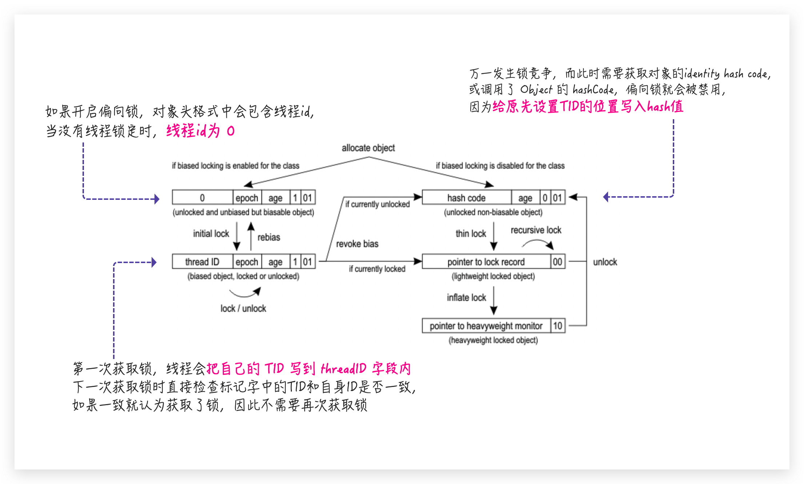

# 对象头

| 内容                   | 说明                       | 备注                 |
| ---------------------- | -------------------------- | -------------------- |
| Mark Word              | 存储对象的Mark Word信息    | -                    |
| Class Metadata Address | 存储指向对象存储类型的指针 | -                    |
| Array Length           | 数组的长度                 | 只有数组对象有该属性 |

在32位下，Mark Word的存储结构如下：

| 锁状态   | 23 bits                        | 2 bits | 4 bits   | 1 bit | 2 bits |
| -------- | ------------------------------ | ------ | -------- | ----- | ------ |
| 无锁状态 | identity hash code（首次调用） |        | 分代年龄 | 0     | 01     |
| 偏向锁   | Thread ID                      | epoch  | 分代年龄 | 1     | 01     |
| 轻量级锁 | 指向线程栈中Lock Record的指针  |        |          |       | 00     |
| 重量级锁 | 指向监视器（monitor）的指针    |        |          |       | 10     |
| GC标记   | 0                              |        |          |       | 11     |

在64位下，Mark Word的存储结构如下：

| 锁状态   | 25 bits                       | 31 bits                        | 1 bit  | 4 bits   | 1 bit | 2 bits |
| -------- | ----------------------------- | ------------------------------ | ------ | -------- | ----- | ------ |
| 无锁状态 | unused                        | identity hash code（首次调用） | unused | 分代年龄 | 0     | 01     |
| 锁状态   | 54 bits                       | 2 bits                         | 1 bit  | 4 bits   | 1 bit | 2 bits |
| 偏向锁   | Thread ID                     | epoch                          | unused | 分代年龄 | 1     | 01     |
| 锁状态   | 62 bits                       | 2 bits                         |        |          |       |        |
| 轻量级锁 | 指向线程栈中Lock Record的指针 | 00                             |        |          |       |        |
| 重量级锁 | 指向监视器（monitor）的指针   | 10                             |        |          |       |        |
| GC标记   | 0                             | 11                             |        |          |       |        |

